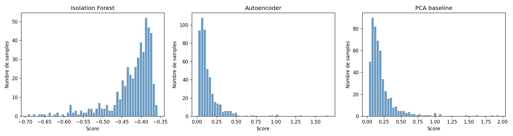
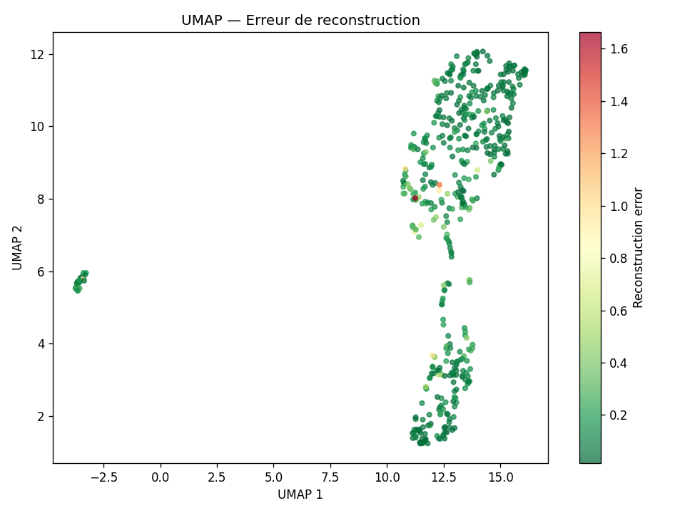
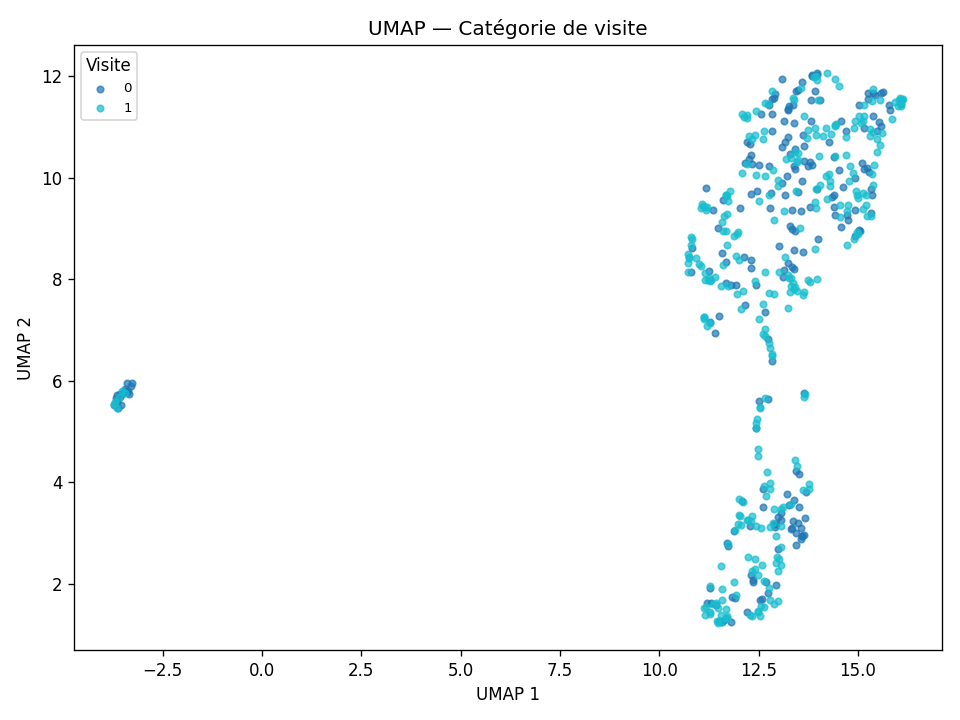
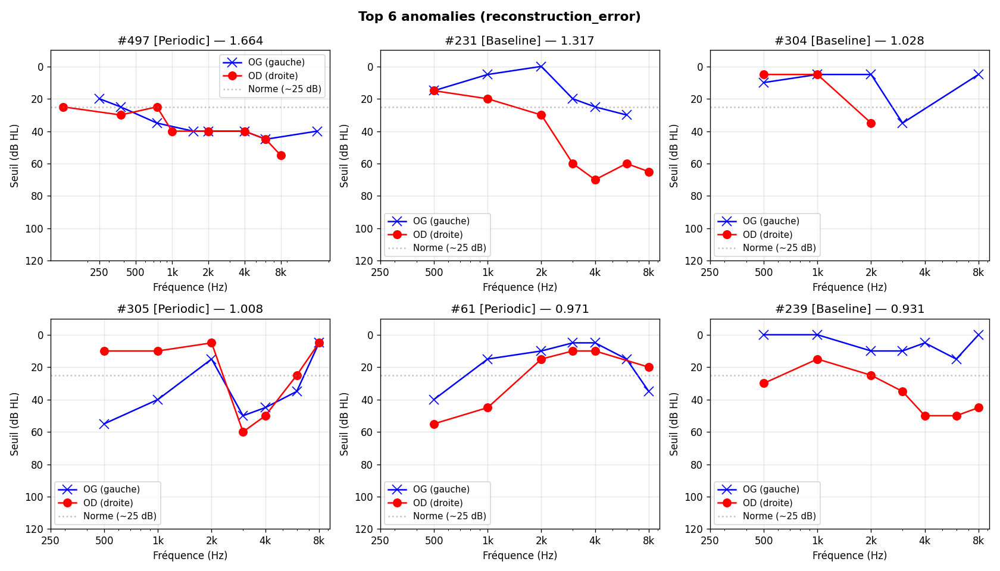

# Synthèse — Détection d'anomalies sur 500 audiogrammes

**Dataset :** `CORTI_sample_audiograms_500.json`  
**Date d'analyse :** 2026-04-28  
**Pipeline :** Correction OSHA → Feature engineering → Isolation Forest · Autoencoder (PyTorch) · PCA baseline  

---

## 1. Prétraitement — Correction normative âge/genre (OSHA)

Avant toute modélisation, les seuils auditifs bruts sont transformés en **résidus par rapport à la norme OSHA 29 CFR 1910.95 Appendix F** :

```
résidu(fréquence) = seuil_mesuré(dB) − seuil_attendu_OSHA(âge, genre, fréquence)
```

Les tables OSHA sont appliquées fréquence par fréquence (250 Hz à 8 kHz), avec interpolation linéaire entre les points de la table (couverture 20–60 ans, hommes Table F-1 et femmes Table F-2). L'âge et le genre sont également inclus comme features directes dans le vecteur d'entrée.

**Conséquence directe :** les modèles n'apprennent pas à détecter les seuils élevés en valeur absolue, mais les **écarts à la norme démographique**. Une presbyacousie typique d'un homme de 55 ans produit un résidu ≈ 0 et ne sera pas flaggée. Une anomalie détectée signifie donc "anormal pour cet âge et ce genre".

---

## 2. Résumé des détections

| Modèle | Anomalies détectées | % du dataset |
|---|---|---|
| Isolation Forest | 25 | 5.0 % |
| Autoencoder (erreur de reconstruction) | 25 | 5.0 % |
| PCA baseline | 25 | 5.0 % |
| **Consensus (≥ 2 méthodes)** | **21** | **4.2 %** |

Les trois modèles sont calés sur un seuil de contamination de 5 %, fixé a priori. Sur les 25 anomalies signalées par chaque méthode, **21 sont confirmées par au moins deux modèles indépendants** (84 % d'accord), ce qui indique une forte robustesse des détections.

---

## 3. Distributions des scores



### Lecture par modèle

**Isolation Forest**  
L'axe des scores est inversé (un score très négatif = plus anormal). La distribution principale est concentrée entre −0.45 et −0.35, avec une moyenne de −0.425 et un écart-type de 0.059. Les anomalies forment une queue gauche visible à partir de −0.55, avec des cas extrêmes descendant jusqu'à −0.693. La séparation entre la masse normale et la queue anormale est nette, ce qui traduit une bonne discrimination de l'algorithme.

**Autoencoder**  
L'erreur de reconstruction suit une distribution fortement asymétrique à droite : la grande majorité des audiogrammes présente une erreur inférieure à 0.25 (moyenne = 0.142, écart-type = 0.157), ce qui signifie que le modèle a bien appris la structure typique des audiogrammes. Les outliers forment une queue s'étirant jusqu'à 1.664. Cette forme est attendue et saine pour un autoencoder entraîné sur des données majoritairement normales.

**PCA baseline**  
Comportement similaire à l'autoencoder avec une queue allant jusqu'à 1.943 (moyenne = 0.213, écart-type = 0.217). La PCA est plus sensible aux variations globales de profil, ce qui explique un écart-type légèrement plus élevé. Elle constitue ici un filet de sécurité complémentaire à l'autoencoder.

---

## 4. Projection UMAP — Erreur de reconstruction



La réduction dimensionnelle UMAP révèle deux structures distinctes dans les données :

- **Nuage principal** (droite du graphe) : ~495 audiogrammes forment un ensemble dense et continu. La majorité est colorée en vert foncé (erreur faible), confirmant que le modèle reconstruit bien les profils typiques.
- **Cluster isolé** (gauche du graphe, x ≈ −2.7, y ≈ 5.7) : un petit groupe de ~5 points, nettement séparés du reste. Ces audiogrammes sont structurellement très différents de la population générale. Leur erreur de reconstruction est modérée (orange/jaune), ce qui suggère des profils inhabituels mais pas nécessairement pathologiques — ils méritent une inspection manuelle prioritaire.
- **Points rouges/orange** dans le nuage principal : les anomalies à haute erreur (> 0.8) sont localisées dans la zone de transition entre les deux sous-groupes visibles du nuage (y ≈ 7–9), là où la densité diminue. Ce positionnement confirme qu'il s'agit de cas en marge de la distribution normale.

**Interprétation clinique :** la séparation spatiale du petit cluster isolé suggère une différence de structure des données (fréquences testées, valeurs manquantes, ou profil audiométrique radicalement atypique) plutôt qu'une simple anomalie de sévérité.

---

## 5. Projection UMAP — Catégorie de visite



Les deux catégories encodées (0 = Baseline, 1 = Periodic) se mélangent uniformément dans l'espace UMAP : aucune séparation spatiale n'est observable entre visites initiales et visites de suivi.

**Ce que cela implique :**
- La catégorie de visite n'est pas un discriminant fort des profils audiométriques dans ce dataset.
- Les audiogrammes de suivi (Periodic) ne présentent pas de structure systématiquement différente des bilans initiaux (Baseline), du moins au niveau des features utilisées.
- Si la progression temporelle de la perte auditive est un objectif futur, il faudra incorporer des features de delta inter-visites (par patient) plutôt que de traiter chaque visite indépendamment.

---

## 6. Profils des cas les plus anormaux



Les 6 audiogrammes avec la plus haute erreur de reconstruction (autoencoder) présentent tous des caractéristiques audiologiquement atypiques **après correction normative OSHA** — leur résidu dépasse ce qui est attendu pour leur âge et leur genre :

| # | Catégorie | Erreur AE | Motif d'anomalie |
|---|---|---|---|
| 497 | Periodic | 1.664 | Profil plat modéré (~35–40 dB) sur toutes fréquences, symétrique mais inhabituel dans ce dataset |
| 231 | Baseline | 1.317 | Forte asymétrie : OD (rouge) présente une perte progressive hautes fréquences (60–65 dB à 4–8 kHz), OG (bleu) quasi-normal |
| 304 | Baseline | 1.028 | OD avec perte modérée en basses fréquences puis remontée, OG quasi-normal ; profil asymétrique et en forme de U inversé |
| 305 | Periodic | 1.008 | OD quasi-normal, OG avec perte marquée à 500 Hz (~55 dB) puis amélioration aux hautes fréquences ; profil en encoche basse fréquence |
| 61 | Periodic | 0.971 | Audiogramme en cloche : OD commence à 60 dB à 500 Hz, amélioration progressive jusqu'à 2 kHz, puis redescente ; forme rare |
| 239 | Baseline | 0.931 | OG normale (0 dB à toutes fréquences), OD avec perte modérée progressive (25–55 dB) ; asymétrie sévère |

**Patterns récurrents :**
- Les **asymétries inter-oreilles** représentent le motif le plus fréquemment capturé (cas #231, #304, #239). C'est audiologiquement pertinent : une différence > 15–20 dB entre les deux oreilles est un signal clinique d'alerte.
- Les **profils en forme atypique** (encoche basse fréquence #305, audiogramme en cloche #61) sont également bien détectés.
- Le cas **#497** est intéressant : un profil à 35–40 dB plat n'est pas sévère en valeur absolue, mais après soustraction de la correction OSHA attendue pour cet âge/genre, le résidu reste anormalement élevé et uniforme — c'est ce pattern inhabituel que l'autoencoder pénalise.

---

## 7. Cas flaggés par une seule méthode

Quatre anomalies sont détectées **uniquement par l'Isolation Forest** (non confirmées par AE ni PCA) :

| Index | Score IF | Erreur AE | Erreur PCA |
|---|---|---|---|
| 30 | −0.601 | 0.305 | 0.386 |
| 38 | −0.614 | 0.134 | 0.232 |
| 39 | −0.679 | 0.278 | 0.360 |
| 40 | −0.693 | 0.337 | 0.298 |

Ces cas ont des scores IF extrêmes (les plus bas du dataset) mais des erreurs de reconstruction modérées. L'Isolation Forest est sensible aux points isolés dans l'espace de features, même si le modèle peut les reconstruire. Ils correspondent probablement à des **combinaisons de features rares** plutôt qu'à des profils audiométriques sévèrement anormaux. À investiguer en priorité basse.

---

## 8. Conclusion et recommandations

### Bilan
Le pipeline de détection non-supervisée fonctionne correctement sur ce dataset de 500 audiogrammes. Les trois modèles convergent sur 21 cas robustement anormaux (4.2 % du dataset), les distributions sont bien séparées, et les cas détectés présentent des caractéristiques audiologiquement plausibles.

### Limites
- **Absence de ground truth :** sans labels cliniques validés, la précision réelle ne peut pas être mesurée. La validation par un audiologiste sur les 21 cas consensus est nécessaire.
- **Seuil de contamination fixé à 5 % :** ce choix arbitraire définit mécaniquement le nombre d'anomalies. Si la prévalence réelle des audiogrammes atypiques est différente, recalibrer le seuil.
- **Couverture OSHA limitée à 20–60 ans :** les sujets hors de cette plage sont clampés aux bornes de la table. Pour les moins de 20 ans ou les plus de 60 ans, la correction est approximative.
- **Features temporelles absentes :** le modèle traite chaque visite indépendamment. L'évolution de la perte auditive entre visites Baseline et Periodic n'est pas exploitée.

### Prochaines étapes suggérées
1. Inspection manuelle des 21 cas consensus par un clinicien pour valider la pertinence des détections.
2. Investigation du petit cluster UMAP isolé (~5 points) pour identifier s'il s'agit d'un problème de données ou d'un profil clinique spécifique.
3. Enrichir les features avec des dérivées inter-visites pour capturer la progression temporelle de la perte auditive.
